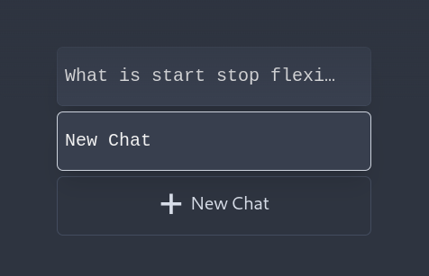
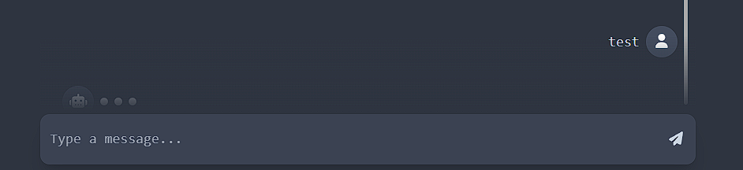
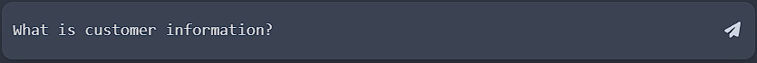
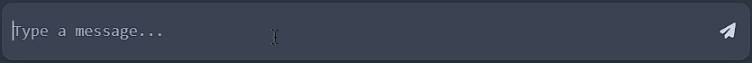
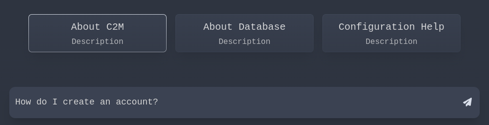
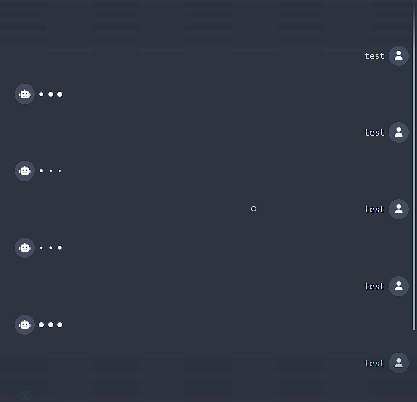

---
#  Hello, here is the list of all functions, important variable and the workings and role of each of them.

## src > Constants.jsx:
    
### Variables:
-    URL: URL of the Server for socket connection.
    
-    socket: Socket object which is used to connect to the server.

-    nord: Nord theme colors.

-    logoColors: Colors corresponding to the I N U S of the TEKGEMINUS logo.

-    logoText: TEKGEMINUS split into Array of characters, as a string cannot be mapped.

-    logo: Converting logo text into html elements with slide in from top + fade in effect.

-    greetingText: Greeting text for the user.

-    greeting: Converting greeting text into html elements with text generating effect.

-    placeholder: Placeholder text for the input field.

-    socials: Logos with links to Tekg's socials.

-    info: Info icon on top right.
    

### Functions:
-    getWindowDimensions, useWindowDimensions: To get the dimensions of the window dynamically.

## src > components > MessageDisplay.jsx:
###    Variables:
-    isSpinning: To check if the Regenerate Text button is being hovered & spinning or not.

-    messageCache: To store message elements for future use after they are proccessed once and formatted with codeblocks/tables.

-    open: To check if the Sources text is expanded or not.

-    spin: To store the angle of the Regenerate button icon.

-    history: To display the chat history .

###    Functions:

-   resetCache: To reset message cache on changing active chat.

-    spinner: To set the angle of the Regenerate button icon when it is being hovered, this is required as using font awesome's spin, it resets to 0deg instantly which looks jarring.

-    formatResponse: To format the response from the server to display it properly with codeblocks and tables in the chat window.

## src > components > Dots.jsx:
###    Variables:
-    dots: To store the dots for the loading animation.

## src > components > Home.jsx:
###    Variables:

-    messages: Stores active message history.

-    statelessMessages: Stateless copy of messages.

-    chatStore: Collection of message histories of all chats.

-    types: Array of types of prompt template.

-    chatType: Selected prompt template for active chat.

-    chatTypeStore: Collection of selected prompt templates of all chats.

-    received: To prevent the user from sending messages to the server when the server already proccessing the previous query.

-    cSHeight: To store the height of the chat section.

-    switched: To prevent the replaying of text generation effect for responses on switching chats.

-    sendButtonKey: To store the key code of the send button to animate it once pressed.

-    typeSelect: Prompt template selecter at the start of a new chat.

-    chatTitles: List of chats with the most recent query of each chat as its name.
    

###    Functions:
    
-    sendMessages: To send the message to the server.
    
-    regenerate: To send a regenerate response request to the server.

### Elements:
- ####   Name List with + New Chat
    List of Chats along with add new chat button.
    #   
- ####   Bottom Fadeout: 
    To Fade out chat as it reaches the bottom end.
    #    

- ####    Message Box: 
    - Text input box : 
        - with animated placeholder when blur
        -  
        - with normal placeholder when focused
        - 

    -  textarea: Text area
    -  AnimatePresence: Animated Placeholders
    -  FontAwesomeIcon: Send button (Paper plane)
    ---
- ####    Chat Type Selecter
       
    ---
- ####    Messafe Display: 
    
    ---    
- ####    Top Fadeout: Same as Bottom Fadeout but for the top end.
  
- ####    Greeting: Greeting for user.
    
- ####    Logo: TEKGEMINUS logo.

- ####    Info Icon T-R: Info Button on Top-Right.

- ####    Copyright Info B-L: Copyright Info on Bottom Left.

- ####    Links to social B-R: Links to Tekgeminus' social media pages.

---
### src > components > ui > flipwords.jsx:
- Used for animating placeholder text, from accentricity ui.

### scr > components > ui > text-genereate-effect.jsx
- Used for animating response received from the server.
- Used for animating greeting for the user.
- This is also from accentricity ui, but it has been heavily modified.